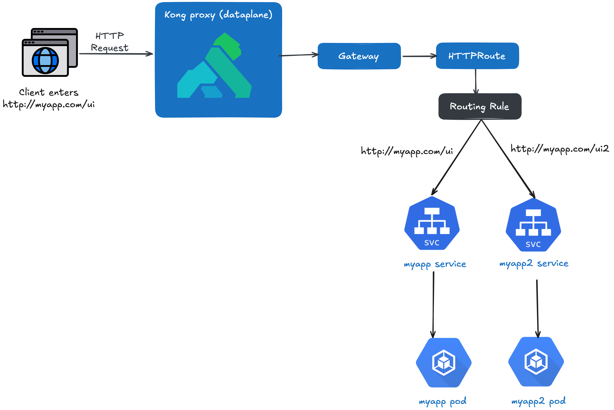

<h1 align="center">
    Gateway API on Kubernetes With Kong Gateway 🦍
</h1>

This repo aims to give you a basic understanding of how to configure Gateway API on a k8s cluster for traffic routing.

We won't go into the details of what Gateway API is and every controller implementation.

We'll be using Kong as our controller for this demo.

We'll use minikube to create our demo cluster.

I highly recommend you also check out the [official Kong gateway deployment tutorial](https://developer.konghq.com/operator/dataplanes/get-started/kic/install/). I created this demo as more of a hand-holding guide in case you run into issues following the tutorial.

The diagram below shows what we’ll be setting up.



## Prerequisites
- [minikube](https://minikube.sigs.k8s.io/docs/start/?arch=%2Fmacos%2Farm64%2Fstable%2Fbinary+download)
- [docker](https://www.docker.com/)
- [kubectl](https://kubernetes.io/docs/reference/kubectl/)

## Getting Started 

### 1. Setup the Cluster and Ingress Controller

Start our minikube cluster:
```bash
minikube start
```

### 2. Deploy Sample Applications

Let's deploy 2 different hello world apps on our cluster so we have something to reach:
```bash
kubectl apply -f manifest/myapp -f manifest/myapp2
```

Check that our `myapp` and `myapp2` pods and services have been deployed successfully:
```bash
kubectl get all
```

You should see internal services for both `myapp` and `myapp2` deployments.


### 3. Install Kong Gateway Operator with Kong Ingress Controller

Visit kong's [gateway operator installation](https://developer.konghq.com/operator/dataplanes/get-started/kic/install/) page to get started.

Or if you are too lazy, just copy the block below.

Essentially, from the installation page, there are two main things we are installing:

1. Gateway API CRDs: Installs the CRDs for the Kubernetes Gateway API (types like GatewayClass, Gateway, HTTPRoute, etc.). By default, Gateway API resources do not come installed on the cluster. At the time this demo was written, Gateway API is at release v1.3.0.

2. Kong Gateway Operator: Installs the Kong Gateway Operator, which includes the Kong Ingress Controller (KIC). It also enables the CRDs so the operator can watch and reconcile Gateway/HTTPRoute, etc.


Installing the Gateway API CRDs and Kong Gateway Operator:
NOTE: The below will install Gateway API CRDs v1.3.0 and the Kong operator v1.6.1, which were the latest when I created this demo.
```bash
# Install the gateway crds
kubectl apply -f https://github.com/kubernetes-sigs/gateway-api/releases/download/v1.3.0/standard-install.yaml

# Install Kong Gateway Operator using helm charts
helm repo add kong https://charts.konghq.com
helm repo update

helm upgrade --install kgo kong/gateway-operator -n kong-system --create-namespace \
  --set image.tag=1.6.1 \
  --set kubernetes-configuration-crds.enabled=true \
  --set env.ENABLE_CONTROLLER_KONNECT=true

# Wait for kong gateway operator to be ready
kubectl -n kong-system wait --for=condition=Available=true --timeout=120s deployment/kgo-gateway-operator-controller-manager
```

This is what we should expect to see when kong gateway operator is ready:
```bash
deployment.apps/kgo-gateway-operator-controller-manager condition met
```

### 4. Creating A Gateway

For this demo there are a few resources we'll create to give you a somewhat more realistic scenario of what you might do in a cluster. Let's walk through what's in [manifest/gateway_api](manifest/gateway_api).

Below is a simple visualisation of how an HTTP request will be routed with Gateway API.


#### 4a. [namespace.yaml](manifest/gateway_api/namespace.yaml)

This needs no explanation really. We're just creating a namespace for our Gateway API resources.

```bash
kubectl apply -f manifest/gateway_api/namespace.yaml
```

#### 4b. [gateway_config.yaml](manifest/gateway_api/gateway_config.yaml)

This isn't strictly required for Kong to work, but it's useful to control the image used, set environment variables, and apply updates to the Kong operator.

Include this so you have a single source of truth for your gateway configuration.

```bash
kubectl apply -f manifest/gateway_api/gateway_config.yaml
```

#### 4c. [gateway_class.yaml](manifest/gateway_api/gateway_class.yaml)

This defines one of the Gateway API kinds, `GatewayClass`. You can think of this like the NGINX controller if you're more familiar with Ingress.

Essentially, this is the definition of a controller (Kong in our case) that implements the class. Gateways of this class will be managed by the controller.

```bash
kubectl apply -f manifest/gateway_api/gateway_class.yaml
```

#### 4d. [gateway.yaml](manifest/gateway_api/gateway.yaml)

This is the actual gateway, it describes an instance of traffic-handling infrastructure (e.g., listen on HTTP port 80).

It defines a network endpoint that can process traffic: filtering, balancing, splitting, etc., for backends such as a Service.

```bash
kubectl apply -f manifest/gateway_api/gateway.yaml
```

#### 4e. [http_route.yaml](manifest/gateway_api/http_route.yaml)

The `HTTPRoute` kind specifies routing behavior of HTTP requests from a Gateway listener to backend network endpoints.

This is very similar to defining rules in an `Ingress`. We set up which paths go to which services and the hostname.

```bash
kubectl apply -f manifest/gateway_api/http_route.yaml
```

We can see it with:

```bash
kubectl get httproute -n kong
```

We should see

```bash
NAME               HOSTNAMES       AGE
myapp-http-route   ["myapp.com"]   16s
```

#### 4f. [reference_grant.yaml](manifest/gateway_api/reference_grant.yaml)

This comes into play when your services live in a different namespace than your Gateway/HTTPRoute.

In this demo, Gateway API resources (Gateway, HTTPRoute) are in the `kong` namespace, but `myapp` and `myapp2` run in `default`. Because our Gateway listener allows routes from the same namespace, we keep the `HTTPRoute` in `kong` and allow it to reference Services in `default` via a `ReferenceGrant`.

Apply the [reference_grant.yaml](manifest/gateway_api/reference_grant.yaml) to allow cross-namespace Service references. See [Kong docs](https://developer.konghq.com/kubernetes-ingress-controller/routing/cross-namespace/#prerequisites) for more details.

```bash
kubectl apply -f manifest/gateway_api/reference_grant.yaml
```

We can also see this with
```bash
kubectl get ReferenceGrant 
```

### 5. Minikube Tunnel

If you've seen my k8s-ingress-demo, you know that by default minikube uses the Docker driver, which means minikube runs inside a Docker container (on my Mac).

The host (my Mac) can't directly reach Docker container IPs unless we tunnel traffic from the host to Docker. We can do that using the `minikube tunnel` command.

On a new terminal, run:

```bash
minikube tunnel
```

Keep this terminal open. Enter your admin password when prompted, it needs sudo to expose privileged ports like 80. This is what gives our LoadBalancer service an external IP (127.0.0.1 on macOS).

### 6. Mapping myapp.com to an IP

We don't actually own [myapp.com](myapp.com), so we'll map it in `/etc/hosts`. 

Map the domain locally so the browser sends the right Host header:
```bash
sudo vi /etc/hosts
```
Add this line:
```
127.0.0.1       myapp.com
```

Your file should look something like this:

```bash
##
# Host Database
#
# localhost is used to configure the loopback interface
# when the system is booting.  Do not change this entry.
##
127.0.0.1       localhost
255.255.255.255 broadcasthost
::1             localhost
127.0.0.1       myapp.com
```

I've already explained why we need to map our localhost when using minikube with the Docker driver in my [other demo](https://github.com/osw282/k8s-ingress-demo?tab=readme-ov-file#4-the-docker-driver-problem-and-the-fix), so I won't go into the details here.

### 7. See it working

Open the browser and hit the first app: [http://myapp.com/ui](http://myapp.com/ui)


Now the second app: [http://myapp.com/ui2](http://myapp.com/ui2)


# Clean Up

Run `minikube delete` to shutdown the cluster.
